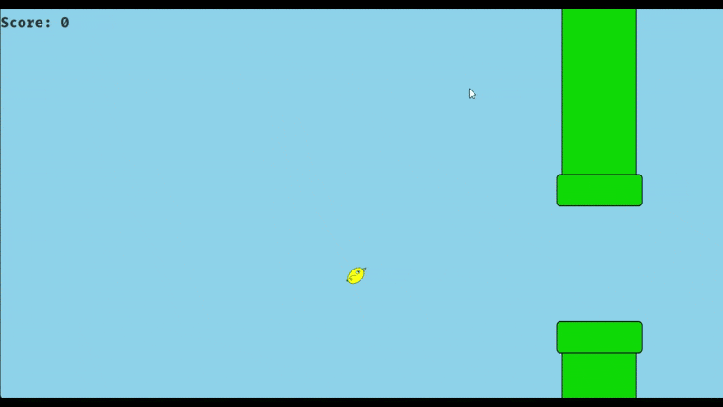

# Flappy Bird Clone :bird:

Do you remember Flappy Bird? It's an easy coding and fun game. I decided to learn Swing and this was the result. This is not my first time coding Java, but it's the first project I have complete. It doesn't mean that it doesn't need improvements, but I am satisfied with the work for now. In the future, I can add more features, since games are not my big interest at this moment. It's a non-relevant side project made just for fun.



## How to run :running:

```bash
javac *.java && java Main
```

## How to play :video_game:

`SPACE` - Start/Restart and Fly
